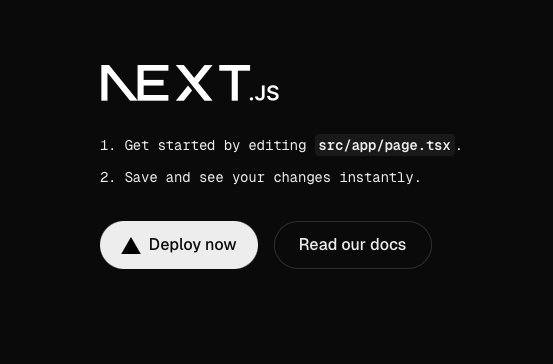
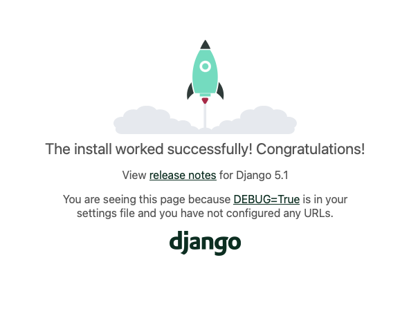

# Next.js と Django の開発環境の構築
個人開発を始めるにあたり、まずは Docker で Next.js と Django の開発環境を構築します。

## Next.js の準備
初めに、フロントエンドで使う Next.js の環境を作ります。
Docker Hub で配布されている公式の Node.js イメージをベースに、```yarn``` の ```create next-app``` を利用して必要なコードを生成します。
まずは、Node.js の Docker 環境を作るために、以下の通り ```docker-compose.yml``` を用意します。
Node.js のバージョンは記事執筆時点で最新のものを利用し、Debian Bullseye ベースのイメージを選択しました。

```docker-compose.yml```
```yml
services:
  # フロントエンド：Next.js
  blog_frontend:
    image: node:23.10-bullseye
    container_name: frontend_next_container
    environment:
      - TZ=Asia/Tokyo
      - WATCHPACK_POLLING=true
    ports:
      - 3000:3000
    tty: true
    volumes:
      - ./frontend:/app
```

上記の ```docker-compose.yml``` をもとに、Node.js のイメージ ```node:23.10-bullseye``` をプルしてきます。

```bash
$ docker compose pull 
```

次に、コンテナを立ち上げて Next.js のプロジェクトを作成します。

```bash
# ホスト側のシェルから実行
$ docker compose run --remove-orphans blog_frontend sh

# コンテナ内のシェルで実行
$ yarn create next-app app --ts
yarn create v1.22.22
[1/4] Resolving packages...
[2/4] Fetching packages...
[3/4] Linking dependencies...
[4/4] Building fresh packages...
success Installed "create-next-app@15.2.4" with binaries:
      - create-next-app
✔ Would you like to use ESLint? … No / Yes
✔ Would you like to use Tailwind CSS? … No / Yes
✔ Would you like your code inside a `src/` directory? … No / Yes
✔ Would you like to use App Router? (recommended) … No / Yes
✔ Would you like to use Turbopack for `next dev`? … No / Yes
✔ Would you like to customize the import alias (`@/*` by default)? … No / Yes
✔ What import alias would you like configured? … @/*
```

TypeScript を利用するので、```--ts``` オプションを付けて、```app``` という名前のアプリケーションを作成しました。
ESLint や Tailwind CSS を使うかなどいくつか聞かれますが、全て Yes としておきました。
上記を実行すると ```frontend``` ディレクトリの下に以下のようなファイル類が配置されます。

```
./frontend
├── README.md
├── eslint.config.mjs
├── next-env.d.ts
├── next.config.ts
├── node_modules
├── package.json
├── postcss.config.mjs
├── public
├── src
├── tsconfig.json
└── yarn.lock
```

最後に、```docker-compose.yml``` に下記を追加して、Next.js のサンプルページにアクセスしてみます。

```docker-compose.yml```
```yml
services:
  # フロントエンド：Next.js
  blog_frontend:
    ...
    volumes:
      - ./frontend:/app
    working_dir: /app
    command: sh -c "yarn install && yarn dev"
```

```bash
$ docker compose up blog_frontend
```

[http://localhost:3000](http://localhost:3000) にアクセスして、以下のページが表示されるか確認します。

<div align="center">
    
</div>

## Djangoの準備
続いて、Python の Web フレームワークである Django の Docker 環境をセットアップします。
まず、 Dockerfile を用意します。
```backend``` ディレクトリの直下に ```Dockerfile``` を作成し、以下の内容を記述します。

```backend/Dockerfile```
```dockerfile
FROM python:3.13.2-bullseye

ENV PYTHONUNBUFFERED 1

RUN pip install --upgrade pip setuptools && \
    pip install Django==5.1.7
```

次に、```docker-compose.yml``` に以下を追記します。

```docker-compose.yml```
```yml
services:
  # バックエンド：Django
  blog_backend:
    build:
      context: .
      dockerfile: ./backend/Dockerfile
    container_name: backend_django_container
    environment:
      - TZ=Asia/Tokyo
    tty: true
    volumes:
      - ./backend:/app
    working_dir: /app
```

ここで、一度コンテナを立ち上げて Django のプロジェクトを作成します。

```bash
# ホスト側のシェルから実行
$ docker compose build blog_backend
$ docker compose run --remove-orphans blog_backend sh

# コンテナ内のシェルで実行
$ django-admin startproject app .
```

すると、```backend``` ディレクトリの配下に、以下の通りファイルが生成されます。

```
./backend
├── Dockerfile
├── app
│   ├── __init__.py
│   ├── asgi.py
│   ├── settings.py
│   ├── urls.py
│   └── wsgi.py
└── manage.py
```

最後に、```docker-compose.yml``` に接続ポートとサーバの起動コマンドを設定して、コンテナを立ち上げます。

```docker-compose.yml```
```yml
services:
  # バックエンド：Django
  blog_backend:
    ...
    ports:
      - 8000:8000
    ...
    command: python manage.py runserver 0.0.0.0:8000
```

```bash
$ docker compose up blog_backend
```

[http://localhost:8000](http://localhost:8000) にアクセスすると以下のページが表示されます

<div align="center">
    
</div>

## SQLite3 の確認
通常、本番環境ではデータベースとして MySQL や PostgreSQL を使いますが、開発環境では扱うリクエスト数も限られるので、ファイルベースで軽量な SQLite3 を使います。
本番環境では PostgreSQL を利用する予定ですが、Python の ORM (Object-Relational Mapping) はデータベースの種類に非依存となるように作られているので、乗り換えも簡単にできそうです。  
SQLite3 を導入する前に、Django の言語設定とタイムゾーンの設定を変更しておきます。

```backend/app/settings.py```
```python
# 106 行目
LANGUAGE_CODE = 'ja'      # 'en-us' から変更
# 108 行目
TIME_ZONE = 'Asia/Tokyo'  # 'UTC' から変更
```

上記を変更してページをリロードすると、[http://localhost:8000](http://localhost:8000) が日本語表示になります。
次に、同じ ```setting.py``` の SQLite3 周りの設定を確認しておきます。

```backend/app/settings.py```
```python
# Build paths inside the project like this: BASE_DIR / 'subdir'.
BASE_DIR = Path(__file__).resolve().parent.parent

# Database
# https://docs.djangoproject.com/en/5.1/ref/settings/#databases

DATABASES = {
    'default': {
        'ENGINE': 'django.db.backends.sqlite3',
        'NAME': BASE_DIR / 'db.sqlite3',
    }
}
```

```ENGINE``` でデータベースの種別を指定し、```NAME``` でデータベースの情報を指定します。
```BASE_DIR``` で ```setting.py``` の２階層上のディレクトリ (ここでは ```backend``` ディレクトリ) を取得し、その下に ```db.sqlite3``` という名前でデータを保存するファイルを作っています。  
それでは、データベースのマイグレーションをしてみましょう。
マイグレーションは、既存のデータを保持したまま、新規のテーブルを作成したり修正したりできる機能です。
Django では ```migrate``` サブコマンドでマイグレーションが可能です。
まだ、自前のテーブルは定義していませんが、Django ではセッション管理やユーザ管理をするためのモデル定義やマイグレーションファイルがデフォルトで用意されています。
コンテナに入って、マイグレーションを実行してみましょう。

```bash
# ホスト側のシェルで実行
$ docker compose run --remove-orphans blog_backend bash

# コンテナ内のシェルで実行
$ python manage.py migrate 
Operations to perform:
  Apply all migrations: admin, auth, contenttypes, sessions
Running migrations:
  Applying contenttypes.0001_initial... OK
  Applying auth.0001_initial... OK
  Applying admin.0001_initial... OK
  Applying admin.0002_logentry_remove_auto_add... OK
  Applying admin.0003_logentry_add_action_flag_choices... OK
  Applying contenttypes.0002_remove_content_type_name... OK
  Applying auth.0002_alter_permission_name_max_length... OK
  Applying auth.0003_alter_user_email_max_length... OK
  Applying auth.0004_alter_user_username_opts... OK
  Applying auth.0005_alter_user_last_login_null... OK
  Applying auth.0006_require_contenttypes_0002... OK
  Applying auth.0007_alter_validators_add_error_messages... OK
  Applying auth.0008_alter_user_username_max_length... OK
  Applying auth.0009_alter_user_last_name_max_length... OK
  Applying auth.0010_alter_group_name_max_length... OK
  Applying auth.0011_update_proxy_permissions... OK
  Applying auth.0012_alter_user_first_name_max_length... OK
  Applying sessions.0001_initial... OK
```

コンテナを立ち上げたまま、SQLite3 コマンドでマイグレーションの実行結果を確認します。

```bash
# コンテナ内のシェルで実行
$ python    
Python 3.13.2 (main, Mar 18 2025, 22:25:49) [GCC 10.2.1 20210110] on linux
Type "help", "copyright", "credits" or "license" for more information.
>>> import sqlite3
>>> 
>>> conn = sqlite3.connect('db.sqlite3')
>>> cur = conn.cursor()    
>>> cur.execute("SELECT name from sqlite_master where type='table';")
<sqlite3.Cursor object at 0xffffb0c659c0>
>>> for t in cur.fetchall():
...     print(t[0])
...     
django_migrations
sqlite_sequence
auth_group_permissions
auth_user_groups
auth_user_user_permissions
django_admin_log
django_content_type
auth_permission
auth_group
auth_user
django_session
```

複数のテーブルが作成されていることを確認できれば、今回の環境構築は完了です。

※ ```apt``` で ```sqlite3``` パッケージをインストールすれば、CLI から直接 SQLite3 を操作することもできます。
ただ、開発環境に余計なものを入れたくないので、今回は Python のプロンプトから確認しています。