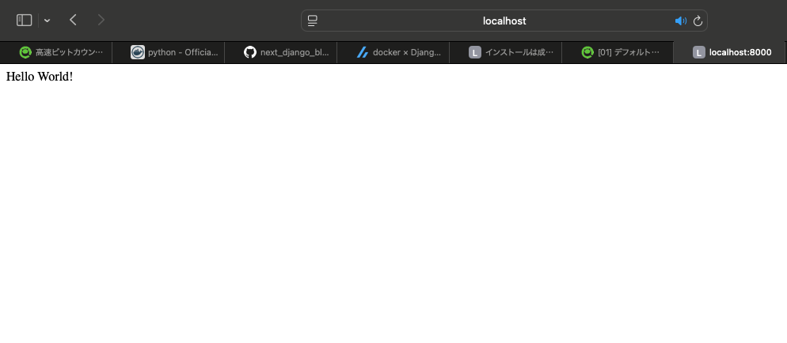

# Django アプリケーションの作成と各種設定
Django は Web サービスをアプリケーション (apps) という単位で分けて実装します。
標準で提供されている認証機能やセッション管理の機能もアプリケーションとして提供されています。
今回は、ブログサービスを提供する ```blog``` アプリケーションを作成して、ルーティングの設定などを行います。

## ```blog``` アプリケーションの作成
まずは ```blog``` アプリケーションを作成します。
これは、```atartapp``` サブコマンドを利用して簡単に実行できます。

```bash
$ python manage.py startapp blog
```

上記のコマンドを実行すると、以下のように ```blog``` ディレクトリと各種ファイルが生成されます。

```
./backend/blog
├── __init__.py
├── admin.py
├── apps.py
├── migrations/
├── models.py
├── tests.py
└── views.py
```

それぞれのファイルの役割は後で詳しく見ていくことにして、ここでは一旦アプリケーションを ```setting.py``` に追加して ```blog``` アプリを使えるようにします。

```backend/app/setting.py```
```python
# INSTALLED_APPS に追加
INSTALLED_APPS = [
    ...
    'blog.apps.BlogConfig',
]
```

## ビューの設定
まずは、トップページに "Hello World!" を表示するプログラムを実装します。
具体的には、次の２点を実装する必要があります。

- リクエスト情報を格納した ```HttpRequest``` オブジェクトを受け取り、レスポンスボディやステータスコードを格納した ```HttpResponse``` オブジェクトを返すビュー (View) 関数
- リクエストを受け取ったパスごとに、適切なビュー関数を呼び出すためのルーティング設定

また、それと併せて正しく処理が行われているかを確認するテストも実装します。
ここでは、テストコードで以下の２点が満たされていることを確認します。

- トップページに GET リクエストを送ると、ステータスコード 200 が返ってくること
- トップページからのレスポンスボディが ```b"Hello World!"``` であること

まずは、テストから実装し、現状の実装ではエラーになることを確認します。
```blog/test.py``` に以下のコードを記述します。

```backend/blog/test.py```
```python
from django.http import HttpRequest
from django.test import TestCase
from blog.views import top

class TopPageViewTest(TestCase):
    # トップページにアクセスしたときにステータスコード 200 が返ってくるか
    def test_top_returns_200(self):
        request = HttpRequest()
        response = top(request)
        self.assertEqual(response.status_code, 200)

    # トップページから返ってきたリクエストボディが b"Hello World!" か
    def test_top_returns_expected_content(self):
        request = HttpRequest()
        response = top(request)
        self.assertEqual(response.content, b"Hello World!")
```

テストを実行してみましょう。

```bash
$ python manage.py test
Found 1 test(s).
System check identified no issues (0 silenced).
E
======================================================================
ERROR: blog.tests (unittest.loader._FailedTest.blog.tests)
----------------------------------------------------------------------
ImportError: Failed to import test module: blog.tests
Traceback (most recent call last):
  File "/usr/local/lib/python3.13/unittest/loader.py", line 396, in _find_test_path
    module = self._get_module_from_name(name)
  File "/usr/local/lib/python3.13/unittest/loader.py", line 339, in _get_module_from_name
    __import__(name)
    ~~~~~~~~~~^^^^^^
  File "/app/blog/tests.py", line 3, in <module>
    from blog.views import top
ImportError: cannot import name 'top' from 'blog.views' (/app/blog/views.py)


----------------------------------------------------------------------
Ran 1 test in 0.000s
```

当然ですが、```top``` 関数が未定義なのでテストは失敗しました。
それでは、ブログのトップページを描画するビュー関数を定義します。

```backend/blog/views.py```
```python
from django.http import HttpResponse

def top(request):
    return HttpResponse(b"Hello World!")
```

```top``` 関数は ```HttpRequest``` オブジェクトを引数として受け取り、```HttpResponse``` オブジェクトを返す関数です。
```HttpResponse``` クラスは、コンストラクタの第1引数にレスポンスボディを渡すことができます。
本来はであれば HTML を返すべきですが、ここでは簡単に ```b"Hello World!"``` を返しています。
これでテストを実行すると、テストが成功することを確認できます。

```bash
$ python manage.py test
Found 2 test(s).
Creating test database for alias 'default'...
System check identified no issues (0 silenced).
..
----------------------------------------------------------------------
Ran 2 tests in 0.000s

OK
Destroying test database for alias 'default'...
```

## ルーティングの設定
現状の実装では、トップページに "Hello World!" は表示できません。
まずは、テストでトップページのパスにリクエストを投げて、所望のレスポンスが得られるかを確かめるコードに変更します。

```backend/blog/views.py```
```python
from django.test import TestCase

class TopPageViewTest(TestCase):
    # トップページにアクセスしたときにステータスコード 200 が返ってくるか
    def test_top_returns_200(self):
        response = self.client.get("/")
        self.assertEqual(response.status_code, 200)

    # トップページから返ってきたリクエストボディが b"Hello World!" か
    def test_top_returns_expected_content(self):
        response = self.client.get("/")
        self.assertEqual(response.content, b"Hello World!")
```

ここでは、```TestCase``` クラスを継承すると生成される ```Client``` オブジェクト (```self.client```) を通してリクエストを投げています。
もう一度テストを実行してみると、次のような結果が出力されます。

```bash
$ python manage.py test
Found 2 test(s).
Creating test database for alias 'default'...
System check identified no issues (0 silenced).
FF
======================================================================
FAIL: test_top_returns_200 (blog.tests.TopPageViewTest.test_top_returns_200)
----------------------------------------------------------------------
Traceback (most recent call last):
  File "/app/blog/tests.py", line 8, in test_top_returns_200
    self.assertEqual(response.status_code, 200)
    ~~~~~~~~~~~~~~~~^^^^^^^^^^^^^^^^^^^^^^^^^^^
AssertionError: 404 != 200

======================================================================
FAIL: test_top_returns_expected_content (blog.tests.TopPageViewTest.test_top_returns_expected_content)
----------------------------------------------------------------------
Traceback (most recent call last):
  File "/app/blog/tests.py", line 13, in test_top_returns_expected_content
    self.assertEqual(response.content, b"Hello World!")
    ~~~~~~~~~~~~~~~~^^^^^^^^^^^^^^^^^^^^^^^^^^^^^^^^^^^
AssertionError: b'\n<!doctype html>\n<html lang="en">\n<hea[144 chars]l>\n' != b'Hello World!'

----------------------------------------------------------------------
Ran 2 tests in 0.003s

FAILED (failures=2)
Destroying test database for alias 'default'...
```

現状、ルーティングの設定がなされていないので、ステータスコード ```404``` (Page Not Found) が返ってきます。
それでは、```urls.py``` にルーティングを追加します。

```backend/app/urls.py```
```python
from django.contrib import admin
from django.urls import path
from blog.views import top      # ここを追加する

urlpatterns = [
    path('', top, name='top'),  # ここを追加する
    path('admin/', admin.site.urls),
]
```

```django.urls.path``` の引数は以下の通りです。

- 第１引数：HTTP　リクエストのパス (先頭の "/" は省略)
- 第２引数：ビュー関数
- ```name```　キーワード引数：URL の逆引きで使う名前

これでテストを実行すると成功します。

```bash
$ python manage.py test
Found 2 test(s).
Creating test database for alias 'default'...
System check identified no issues (0 silenced).
..
----------------------------------------------------------------------
Ran 2 tests in 0.001s

OK
Destroying test database for alias 'default'...
```

また、ブラウザで [http://localhost:8000](http://localhost:8000) にアクセスすると、"Hello World!" が表示されます。

<div align="center">
    
</div>

## 雛形の作成
それでは最後に、今後の雛形を作っておきます。
具体的には、以下のような URL でページを作っていきます。

| メソッド | URL | ビュー関数 | 機能 |
| :--: | :-- | :--: | :--: |
| GET | / | top | ブログ記事の一覧の表示 |
| GET | /articles/new | article_new | ブログ記事の新規作成フォームの表示 |
| POST | /articles/new | article_new | 新規ブログ記事の登録 |
| GET | /articles/<article_id>/ | article_detail | ブログ記事の詳細表示 |
| GET | /articles/<article_id>/edit | article_edit | ブログ記事の編集 |
| POST | /articles/<article_id>/edit | article_edit | ブログ記事の編集 |

まずは、雛形となるビュー関数を定義しておきます。

```backend/blog/views.py```
```python
from django.http import HttpResponse

def top(request):
    return HttpResponse(b"Hello World!")

def article_new(request):
    return HttpResponse('ブログ記事の新規作成')

def article_edit(request):
    return HttpResponse('ブログ記事の編集')

def article_detail(request):
    return HttpResponse('ブログ記事の詳細表示')
```

次に、トップページと同様にテストの雛形も書いておきます。
ここでは、ある URL にアクセスしたときに、期待するビュー単数と紐付いているかを確認するテストとしています。

```backend/blog/tests.py```
```python
from django.urls import resolve

from blog.views import top, article_new, article_edit, article_detail

class CreateArticleTest(TestCase):
    def test_should_resolve_article_new(self):
        found = resolve("/articles/new/")
        self.assertEqual(article_new, found.func)

class ArticleDetailTest(TestCase):
    def test_should_resolve_article_detail(self):
        found = resolve("/articles/1/")
        self.assertEqual(article_detail, found.func)

class EditArticleTest(TestCase):
    def test_should_resolve_article_edit(self):
        found = resolve("/articles/1/edit")
        self.assertEqual(article_edit, found.func)
```

さらに、URL も追加しておきます。
以下の通り、```django.urls.include``` を用いて、アプリケーションごとに URL を分割して定義できます。

```backend/app/urls.py```
```python
from django.contrib import admin
from django.urls import path, include

from blog.views import top

urlpatterns = [
    path('', top, name='top'),
    path('articles/', include('blog.urls')),    # blg/urls.py の読み込み
    path('admin/', admin.site.urls),
]
```

```backend/blog/urls.py```
```python
from django.urls import path

from blog import views

urlpatterns =[
    path("new/", views.article_new, name="article_new"),
    path("<int:article_id>/", views.article_detail, name="article_detail"),
    path("<int:article_id>/edit", views.article_edit, name="article_edit"),
]
```

以上を実装の上でテストを実行するとパスすることが確認できます。