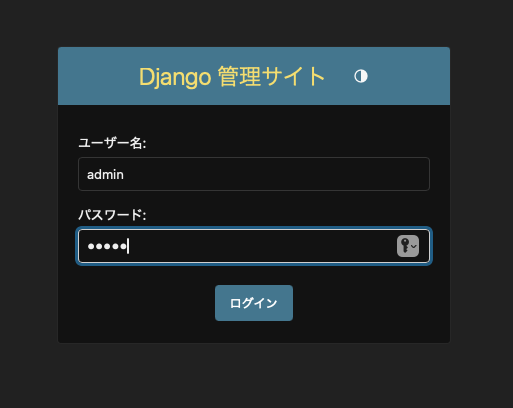
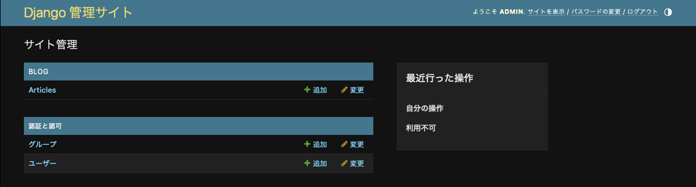
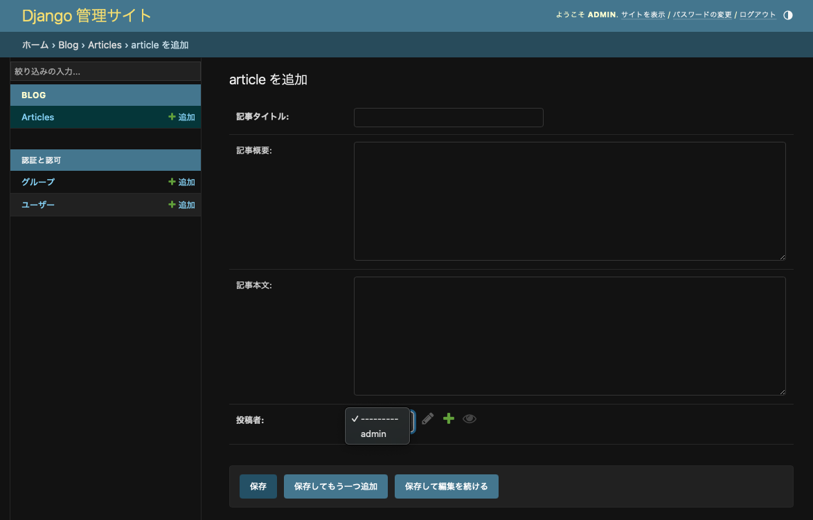
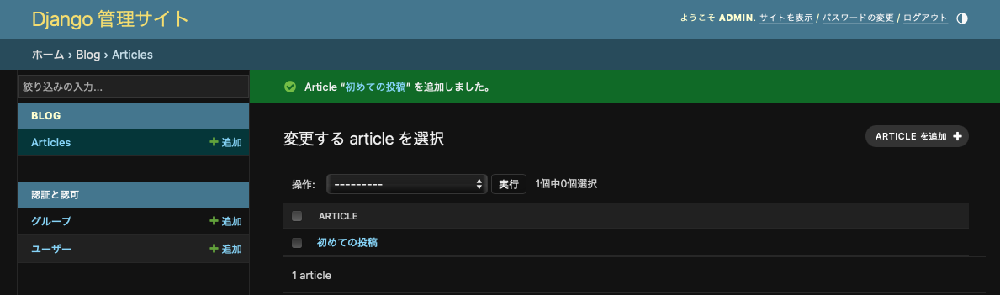

# Django とデータベースの連携
前回は、Django の機能を使って、ブログアプリの雛形を作成しました。
今回は、Django とデータベースを連携し、マイグレーションを実施したりデータの読み書きをしてみたいと思います。

## モデルの定義
Django では、モデル (Model) と呼ばれる機能を通して、データベースとのデータのやり取りを行います。
そして、データのやり取りを実現するためには、以下のような手順を踏む必要があります。

1. ```<app_dir>/models.py``` にモデルを定義
2. ```manage.py makemigrations``` コマンドでマイグレーションファイルを生成
3. ```manage.py migration``` コマンドでマイグレーションを実行

まずは、モデルを定義してみます。
ここでは、ブログ記事の情報を保持する Article モデルを実装します。
Article モデルは以下のカラムを持ちます。

- ```title```: ブログ記事のタイトルで、最大128文字の文字列とします。
- ```abstract```: ブログ記事の概要で、文字数制限はありません。
- ```body```: ブログ記事の本文で、概要と同じく文字数制限はありません。
- ```created_by```: ブログ記事の作成者 (投稿者) で、ユーザモデルの主キーを格納します。
- ```created_at```: ブログ記事が新規作成された日時を保持します。
- ```updated_at```: ブログ記事が更新された日時を保持します。

このモデルは以下のように定義できます。

```backend/blog/models.py```
```python
class Article(models.Model):
    title = models.CharField('記事タイトル', max_length=128)
    abstract = models.TextField('記事概要', blank=True)
    body = models.TextField('記事本文', blank=True)
    created_by = models.ForeignKey(
        settings.AUTH_USER_MODEL,
        verbose_name='投稿者',
        on_delete=models.CASCADE
    )
    created_at = models.DateTimeField("投稿日", auto_now_add=True)
    updated_at = models.DateTimeField("更新日", auto_now=True)

    def __str__(self):
        return self.title
```

モデルは Django の ```models.Model``` を継承します。
また、各カラムは ```model.CharField``` や ```models.DateTimeField``` を使って定義しています。

## データベースのマイグレーション
それでは、定義したモデルをデータベースに適用してみましょう。
まずは、定義されたモデルからマイグレーションに必要なファイルを生成します。
下記のコマンドで必要な SQL が自動生成されるので、自分で ```CREATE TABLE``` 文を書く必要はありません。

```bash
$ python manage.py makemigrations
Migrations for 'blog':
  blog/migrations/0001_initial.py
    + Create model Article
```

上記のコマンドを実行すると、```blog/migrations/``` ディレクトリの下に ```0001_initial.py``` というファイルが生成されます。
これが、自動生成されたマイグレーションファイルです。
次に、以下のコマンドでマイグレーションファイルを適用します。

```bash
$ python manage.py migrate  
Operations to perform:
  Apply all migrations: admin, auth, blog, contenttypes, sessions
Running migrations:
  Applying blog.0001_initial... OK
```

以上でマイグレーションは完了です。

## 管理画面の使い方
標準で提供されている管理画面機能を使うと、データベースにデータを登録したり取得したりできるようになります。
その機能を使うには、アプリケーションの ```admin.py``` を以下の通り書き換えます。

```backend/blog/admin.py```
```python
from django.contrib import admin
from blog.models import Article

admin.site.register(Article)
```

次に、管理画面の操作を行うユーザを作成します。
```createsuperuser``` サブコマンドを使って、ユーザ名とメールアドレス、パスワードを設定します。
分かりやすくユーザ名とパスワードは ```admin```、メールアドレスは ```admin@example.com``` とします。

```bash
$ python manage.py createsuperuser
ユーザー名 (leave blank to use 'root'): admin
メールアドレス: admin@example.com
Password: 
Password (again): 
このパスワードは ユーザー名 と似すぎています。
このパスワードは短すぎます。最低 8 文字以上必要です。
このパスワードは一般的すぎます。
Bypass password validation and create user anyway? [y/N]: y
Superuser created successfully.
```

パスワードが単純すぎて怒られますが、開発環境なので一旦無視して進めます。
管理用のユーザを作成したので、[http://localhost:8000/admin](http://localhost:8000/admin) にアクセスしてログインします。

<div align="center">
    
</div>

ログインしたら次のような画面が表示されます。

<div align="center">
    
</div>

それでは、ブログ記事を1件追加してみましょう。
「Articles」の「＋追加」をクリックすると以下のような画面が表示されるので、それぞれの項目を適当に埋めてください。

<div align="center">
    
</div>

フォームを埋めたら「保存」をクリックして内容をデータベースに書き込みます。

<div align="center">
    
</div>

## シェルからデータベースを操作する
Django の管理画面からだけでなく、シェルから直接データベースを操作することもできます。
```python manage.py shell``` でシェルを起動し、各種操作を実行可能です。
データベースのクエリ操作を行うインターフェースは ```Manager``` と呼ばれ、モデルの ```objects``` を通してアクセスできます。

### レコードの取得 (Read)
先ほど作成した ```admin``` ユーザを取得してみましょう。
```all()``` メソッドを使って全件取得することもできますし、キーワードを指定して取得することもできます。

```bash
$ python manage.py shell
>>> from django.contrib.auth.models import User
>>> users = User.objects.all()
>>> users
<QuerySet [<User: admin>]>
>>> User.objects.get(id=1)
<User: admin>
>>> User.objects.get(username='admin')
<User: admin>
```

### レコードの作成 (Create)
続いて、新しいレコードを作成する例を見てみましょう。
ここでは、新しい記事を登録してみます。
```Article``` モデルのインスタンスを作成し、```save``` メソッドを呼び出すことでデータベースにレコードが追加されます。
なお、```id``` や ```created_at``` はプログラム側で自動的に決定されます。

```bash
>>> from blog.models import Article
>>> admin_user = User.objects.get(id=1)
>>> article = Article(title='タイトル', abstract='記事の概要', body='Hello the second article!', created_by=admin_user)
>>> article.save()
>>> article.id
2
```

### レコードの更新 (Update)
レコードを更新するには、更新対象のレコードを取得して内容を変更した上で、再度 ```save``` メソッドを呼び出します。

```bash
>>> article = Article.objects.get(id=2)
>>> article
<Article: タイトル>
>>> article.body = '更新しました！！'
>>> article.save()
>>> Article.objects.get(id=2).body
'更新しました！！'
```

### レコードの取得 (Delete)
レコードの削除は ```delete()``` メソッドを呼び出すだけです。

```bash
>>> article.delete()
(1, {'blog.Article': 1})
>>> Article.objects.all()
<QuerySet [<Article: 初めての投稿>]>
```

今回は以上となります。