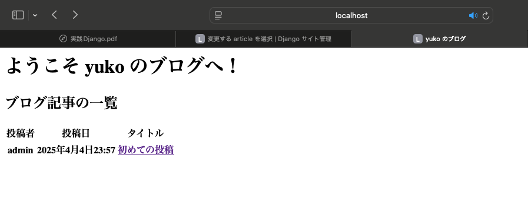

# テンプレートエンジンを用いた HTML の生成
今回は、Django のテンプレートエンジンを用いて HTML を生成し、ブラウザに表示するところまで見ていきます。
また、ビュー関数に関するテストについても記述していきます。

## HTML の生成
まず、トップページに記事の一覧を表示することを考えます。
テンプレートエンジンを用いて HTML を表示してみます。
このとき、少々面倒になるのがテストの内容です。
これまでは、"Hello World!" という文字列がレスポンスのボディに入っていることを確認するだけで良かったのですが、今回からは HTML が返ってくることになります。
ただ、HTML のタグやアトリビュートの値をいちいち確認する必要性は低いため、以下の2点を確認するテストを書くことにします。

- ```/``` にリクエストを送ると、所望の HTML (top.html) が使用されること
- レスポンスのボディに、```<title></title>``` タグで記事のタイトルが含まれること

それでは、```blog/tests.py``` を編集して以下のように書き換えてください。

```backend/blog/tests.py```
```python
class TopPageTest(TestCase):
    def test_top_page_returns_200_and_expected_title(self):
        response = self.client.get("/")
        self.assertContains(response, "初めての投稿", status_code=200)

    def test_top_page_uses_expected_template(self):
        response = self.client.get("/")
        self.assertTemplateUsed(response, "articles/top.html")
```

当然、今の段階ではテストが落ちます。

```bash
$ python manage.py test   
Found 5 test(s).
Creating test database for alias 'default'...
System check identified no issues (0 silenced).
...FF
======================================================================
FAIL: test_top_page_returns_200_and_expected_title (blog.tests.TopPageTest.test_top_page_returns_200_and_expected_title)
----------------------------------------------------------------------
...

AssertionError: False is not true : Couldn't find '初めての投稿' in the following response b'Hello World!'

======================================================================
FAIL: test_top_page_uses_expected_template (blog.tests.TopPageTest.test_top_page_uses_expected_template)
----------------------------------------------------------------------
...

AssertionError: No templates used to render the response

----------------------------------------------------------------------
Ran 5 tests in 0.002s

FAILED (failures=2)
Destroying test database for alias 'default'...
```

続いて、トップページの表示に使う HTML を用意します。
```blog``` ディレクトリの中に ```templates/articles``` ディレクトリを作り、```top.html``` を作成します。

```backend/blog/templates/articles/top.html```
```html
<html>
    <head>
        <meta charset="utf-8">
        <title>初めての投稿</title>
    </head>
    <body>
        <p>Hello Worlds!</p>
    </body>
</html>
```

このままでは ```top.html``` が使われないので、ブログアプリの ```views.py``` を編集します。
Django の ```render``` 関数を使って、```/``` に対するリクエストに ```top.html``` を返すようにします。

```backend/blog/views.py```
```python
from django.shortcuts import render

def top(request):
    return render(request, "articles/top.html")
```

以上の変更でテストが通るようになるはずです。
また、[http://localhost:8000/](http://localhost:8000/) にアクセスすると、次のように HTML で設定した通りに表示されます。

<div align="center">
    
</div>

## トップページにブログ記事の一覧を表示する
トップページにブログ記事の一覧を表示してみましょう。
まずは、その動作を確認するテストケースを記述します。

```backend/blog/tests.py```
```python
from django.test import TestCase, Client, RequestFactory
from django.contrib.auth import get_user_model

from blog.models import Article
from blog.views import top, article_new, article_edit, article_detail

UserModel = get_user_model()


class TopPageTest(TestCase):
    def setUp(self):
        self.user = UserModel.objects.create(
            username="test_user",
            email="test@example.com",
            password="top_secret_pass0001",
        )
        self.article = Article.objects.create(
            title="title1",
            abstract="abstract",
            body="body",
            created_by=self.user
        )

    def test_should_return_article_title(self):
        request = RequestFactory().get("/")
        request.user = self.user
        response = top(request)
        self.assertContains(response, self.article.title)

    def test_should_return_username(self):
        request = RequestFactory().get("/")
        request.user = self.user
        response = top(request)
        self.assertContains(response, self.user.username)
```

```setUp``` メソッドで ```User``` モデルと ```Article``` モデルに1件ずつデータを登録します。
ただし、ここで作成したレコードはテスト終了後にロールバックされるため、実際にデータベースに反映されることはありません。  
次に、ビュー関数と HTML ファイルを変更します。
ビュー関数側でブログ記事を全件取得し、```context``` としてテンプレートの HTML に渡します。
テンプレート内部では、```for``` 文や ```if``` 文を使って表示内容を切り替えています。

```backend/blog/views.py```
```python
from blog.models import Article

def top(request):
    # ブログ記事を全件取得
    articles = Article.objects.all()
    # テンプレートエンジンに渡す Python オブジェクト
    context = {"articles": articles}
    return render(request, "articles/top.html", context)
```

```backend/blog/templates/articles/top.html```
```html
<html>
    <head>
        <meta charset="utf-8">
        <title>yuko のブログ</title>
    </head>
    <body>
        <h1>ようこそ yuko のブログへ！</h1>
        <h2>ブログ記事の一覧</h2>
        
        <table class="table">
            <thead>
                <tr>
                    <th>投稿者</th>
                    <th>投稿日</th>
                    <th>タイトル</th>
                </tr>
            </thead>
            <tbody>
                
                <tr>
                    <th>{{ article.created_by.username }}</th>
                    <th>{{ article.created_at }}</th>
                    <th><a href="">{{ article.title }}</a></th>
                </tr>
                
            </tbody>
        </table>
        
        <p>ブログ記事はまだ投稿されていません。</p>
        
    </body>
</html>
```

ここまででテストを実行すると、テストが通ることを確認できます。
また、以下のように、記事の一覧が表示されるようになります。

<div align="center">
    
</div>

## ブログ記事の詳細ページの実装
ブログ記事を一覧表示するトップページを実装できたので、ブログ記事の詳細を表示するページを作っていきます。
まず、一覧ページと同様にテストから記述します。

```backend/blog/tests.py```
```python
class ArticleDetailTest(TestCase):
    def setUp(self):
        self.user = UserModel.objects.create(
            username="test_user",
            email="test@example.com",
            password="top_secret_pass0001",
        )
        self.article = Article.objects.create(
            title="title1",
            abstract="abstract",
            body="body",
            created_by=self.user
        )

    def test_should_use_expected_template(self):
        response = self.client.get("/articles/%s/" % self.article.id)
        self.assertTemplateUsed(response, "articles/article_detail.html")
    
    def test_should_return_200_and_expected_heading(self):
        response = self.client.get("/articles/%s/" % self.article.id)
        self.assertContains(response, self.article.title, status_code=200)
```

実装内容は記事一覧のページとほぼ同じです。
```setUp``` メソッドでユーザとブログ記事を作成し、```/articles/<article.id>/``` へのリクエストで所望のテンプレートを使って、期待した内容が返ってきているかを確認しています。  
次に、ビュー関数とテンプレート HTML を用意します。
ビュー関数では、```get_object_or_404()``` 関数を利用して ```article_id``` で指定された ID のブログ記事のレコードを取得します。
もし、該当する ID のレコードが見つからなければ 404 Not Found のページを表示します。

```backend/blog/views.py```
```python
from django.shortcuts import render, get_object_or_404
from blog.models import Article

def article_detail(request, article_id):
    # article_id で指定された記事を取得、存在しない場合は 404 ページを返す
    article = get_object_or_404(Article, pk=article_id)
    return render(request, "articles/article_detail.html", {'article': article})
```

```backend/blog/templates/articles/article_detail.html```
```html
<html>
    <head>
        <meta charset="utf-8">
        <title>yuko のブログ</title>
    </head>
    <body>
        <h2>{{ article.title }} by {{ article.created_by.username }}</h2>
        <small>投稿日: {{ article.created_at }}</small>
        <pre>{{ article.abstract }}</pre>
        <p>{{ article.body }}</p>
</html>
```

以上で記事詳細ページの表示とテストが正常に行われるようになります。

<div align="center">
    
</div>

## ブログ記事の新規作成・編集ページの実装
最後に、ブログ記事を新規作成・編集するページを実装します。
例によって、まずはテストから記述します。
新規作成ページのテストでは、```/articles/new/``` に GET リクエストを投げた時にブログ記事の新規作成ページが表示されること、POST リクエストで記事を登録できることを確認します。

```backend/blog/tests.py```
```python
class CreateArticleTest(TestCase):
    def setUp(self):
        self.user = UserModel.objects.create(
            username="test_user",
            email="test@example.com",
            password="top_secret_pass0001",
        )
        self.client.force_login(self.user)

    def test_render_creation_form(self):
        response = self.client.get("/articles/new/")
        self.assertContains(response, "ブログ記事の新規作成", status_code=200)
    
    def test_create_article(self):
        data = {'title': 'タイトル', 'abstract': '概要', 'body': '本文'}
        self.client.post('/articles/new/', data)
        article = Article.objects.get(title='タイトル')
        self.assertEqual('概要', article.abstract)
        self.assertEqual('本文', article.body)
```

次に、新規記事の内容を記入するフォームを作成します。
```blog``` ディレクトリの配下に ```forms.py``` というファイルを作成して以下の内容を記述します。

```backend/blog/forms.py```
```python
from django import forms
from blog.models import Article

class ArticleForm(forms.ModelForm):
    class Meta:
        model = Article
        fields = {'title', 'abstract', 'body'}
```

今はフォームの中では特に何もしていませんが、この内部に入力内容のバリデーションなどを実装することができます。  
フォームを作成した上で、ビュー関数を書き換えます。
まず、記事の作成にはログインが必要なので、```@login_required``` デコレータを付けておきます。
これによって、ログインしていないユーザがアクセスしようとするとログインページ (デフォルトでは ```/accounts/login/```) にリダイレクトされます。
また、リクエストメソッドが ```GET``` か ```POST``` かによって処理を振り分けています。
```GET``` の場合には空白のフォームを返しますが、```POST``` の場合はユーザが入力したデータを取り出して新規登録します。

```backend/blog/views.py```
```python
from django.contrib.auth.decorators import login_required
from django.shortcuts import render, redirect, get_object_or_404

from blog.forms import ArticleForm

@login_required
def article_new(request):
    if request.method == 'POST':
        form = ArticleForm(request.POST)
        if form.is_valid():
            article = form.save(commit=False)
            article.created_by = request.user
            article.save()
            return redirect(article_detail, article_id=article.pk)
    else:
        form = ArticleForm()
    return render(request, "articles/article_new.html", {'form': form})
```

上記のコードにおいて、記事の作成は以下のような流れで行なっています。

1. ```ArticleForm``` クラスに ```POST``` されたリクエスト ```request.POST``` を渡してインスタンスを作成
2. ```is_valid()``` メソッドで有効なデータかどうかをチェック
3. データが有効なら、```POST``` したユーザを ```created_by``` カラムに格納してレコードを作成
4. ブログ記事の詳細ページにリダイレクトして終了

これと同じような流れで、編集ページの実装もしてみましょう。
最初に指定されたブログ記事の内容を取得し、フォームのインスタンス作成時に ```instance``` 引数に渡すこと以外は、基本的に同じように実装できるはずです。

```backend/blog/views.py```
```python
@login_required
def article_edit(request, article_id):
    article = get_object_or_404(Article, pk=article_id)
    if article.created_by.id != request.user.id:
        return HttpResponseForbidden("この記事の編集はできません。")
    
    if request.method == 'POST':
        form = ArticleForm(request.POST, instance=article)
        if form.is_valid():
            form.save()
            return redirect('article_detail', article_id=article_id)
    else:
        form = ArticleForm(instance=article)

    return render(request, "articles/article_edit.html", {'form': form})
```

ビュー関数が用意できたので、それぞれの画面のテンプレートを作成します。

```backend/blog/templates/articles/article_new.html```
```html
<html>
    <head>
        <meta charset="utf-8">
        <title>yuko のブログ</title>
    </head>
    <body>
        <h1>ブログ記事の新規作成</h1>
        <form method="post">
            
            {{ form.as_p }}
            <button type="submit">登録</button>
        </form>
    </body>
</html>
```

```backend/blog/templates/articles/article_edit.html```
```html
<html>
    <head>
        <meta charset="utf-8">
        <title>yuko のブログ</title>
    </head>
    <body>
        <h1>ブログ記事の編集</h1>
        <form method="post">
            
            {{ form.as_p }}
            <button type="submit">保存</button>
        </form>
    </body>
</html>
```

`````` は、Cross Site Request Forgery (CSRF) と呼ばれる攻撃を防ぐために、```POST``` リクエストを受け取る際にトークンを検証しています。  
さて、それでは新規登録ページを開いてみましょう。
新規作成ページにアクセスするには登録済みのユーザでログインしている必要がありますが、ログインページはまだ実装していません。
そのため、一度 [http://localhost:8000/admin/](http://localhost:8000/admin/) にアクセスしてログインし、その後 [http://localhost:8000/articles/new/](http://localhost:8000/articles/new/) を開くと、次のように表示されます。

<div align="center">
    
</div>

ここに適当な内容を入力して「登録」ボタンを押すと、新しい記事が作成され、機序の詳細ページにリダイレクトされます。

<div align="center">
    
</div>

さらに、[http://localhost:8000/articles/<article_id>/edit](http://localhost:8000/articles/<article_id>/edit) にアクセスすると、フォームに記事の内容が入力された状態でページが開きます。

<div align="center">
    
</div>

書き換えた内容が反映された詳細ページにリダイレクトされたら成功です。