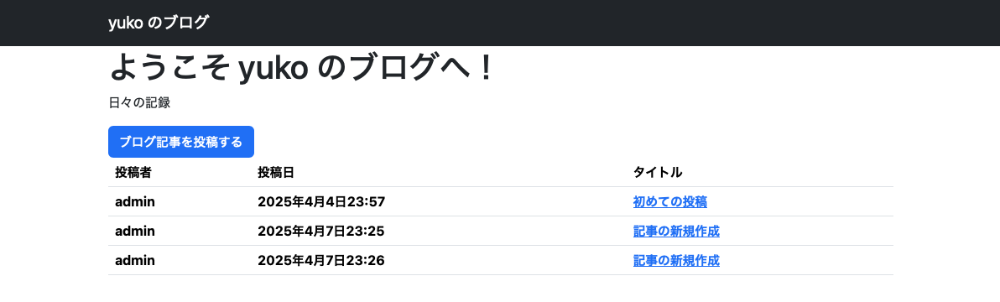
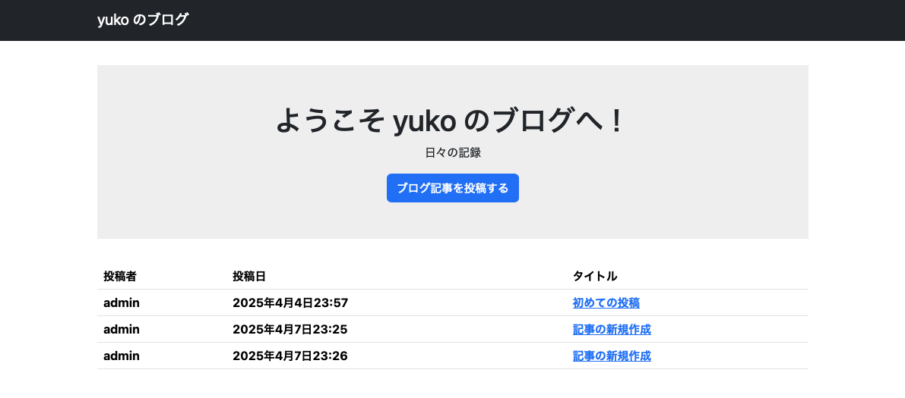

# テンプレートの部品化と CSS の適用
前回、ブログ記事の一覧、詳細表示や新規作成、編集画面を実装しました。
ただ、単純な HTML で構成されたページなので、見た目は非常に簡素なものでした。
今回は、Bootstrap5 で見た目を整えてあげます。
また、静的ファイルの配信やテンプレートの部品化についても見ていきます。

## Bootstrap5 を使って見た目を整える
CSS を使ってページの見た目を整えます。
Django 向けの CSS フレームワークとして ```django-bootstrap5``` が提供されているので、こちらを使ってみます。
```Dockerfile``` に以下を追記して、イメージをビルドし直します。

```backend/Dockerfile```
```dockerfile
RUN pip install django-bootstrap5
```

また、```settings.py``` に下記を追記します。

```backend/app/settings.py```
```python
INSTALLED_APPS = [
    ...
    'django_bootstrap5',
]
```

それでは、```top.html``` に Bootstrap5 のスタイルを適用していきます。

```backend/blog/templates/articles/top.html```
```html

<html>
    <head>
        <meta charset="utf-8">
        <title>yuko のブログ</title>
        
        
    </head>
    <body>
        <nav class="navbar navbar-expand flex-md-row navbar-dark bg-dark">
            <div class="container justify-content-between">
                <a href="/" class="navbar-brand">yuko のブログ</a>
            </div>
        </nav>
        <main>
            <div class="container">
                <div class="welcome">
                    <h1 class="title">ようこそ yuko のブログへ！</h1>
                    <p class="subtitle">日々の記録</p>
                    <a class="btn btn-primary" href="">ブログ記事を投稿する</a>
                </div>

                
                <table class="table">
                    <thead>
                        <tr>
                            <th>投稿者</th>
                            <th>投稿日</th>
                            <th>タイトル</th>
                        </tr>
                    </thead>
                    <tbody>
                        
                        <tr>
                            <th>{{ article.created_by.username }}</th>
                            <th>{{ article.created_at }}</th>
                            <th><a href="">{{ article.title }}</a></th>
                        </tr>
                        
                    </tbody>
                </table>
                
                <p>ブログ記事はまだ投稿されていません。</p>
                
            </div>
        </main>
    </body>
</html>
```

`````` や ``````、`````` は、テンプレートで Bootstrap5 を使うためのおまじないです。
上記のように書き換えてトップページをリロードすると、以下のような見た目になります。

<div align="center">
    
</div>

## 自前の CSS を適用する
Django で自前の CSS のような静的ファイルを配信するには、アプリケーションのディレクトリ配下に ```static``` ディレクトリを作成し、その中に配置します。
ここでは、トップページの装飾用に以下の CSS を用意します。

```backend/blog/static/articles/css/style.css```
```css
main {
    padding: 2rem 0;
}

.welcome {
    padding: 3rem 0;
    margin-bottom: 2rem;
    background-color: #eee;
    align-items: center;
    display: flex;
    flex-direction: column;
}
```

この CSS を適用するには、先ほど手を加えた ```top.html``` に `````` を追加します。

```backend/blog/templates/articles/top.html```
```html


<html>
    <head>
        ...
        <link rel="stylesheet" href="">
    </head>
    ...
```

これで以下のような見た目になります。

<div align="center">
    
</div>

## テンプレートの部品化
テンプレートエンジンを使って他のページについても見た目を整えていきたいと思います。
ただ、全てのページに1からスタイルを適用するのは非常に面倒です。
そこで、各ページの共通する部分まとめて、スタイルを適用するように変更します。  
まずは、ブログアプリケーションの中で共通して使用するナビゲーションバーなどを表示するテンプレートを、```base.html``` として切り出します。
これまでの ```blog/templates/articles``` ディレクトリの中ではわかりづらいので、プロジェクトルートのディレクトリ直下に ```templates``` ディレクトリを作成し、そこに格納します。

```backend/templates/base.html```
```python


<html>
    <head>
        <meta charset="utf-8">
        <title>yuko のブログ</title>
        
        
        <link rel="stylesheet" href="">
        
    </head>
    <body>
        <nav class="navbar navbar-expand flex-md-row navbar-dark bg-dark">
            <div class="container justify-content-between">
                <a href="/" class="navbar-brand">yuko のブログ</a>
            </div>
        </nav>
        <main>
            <div class="container">
                
            </div>
        </main>
    </body>
</html>
```

上記で切り出した箇所以外を残して、```top.html``` を変更します。

```backend/blog/templates/articles/top.html```
```html



<div class="welcome">
    <h1 class="title">ようこそ yuko のブログへ！</h1>
    <p class="subtitle">日々の記録</p>
    <a class="btn btn-primary" href="">ブログ記事を投稿する</a>
</div>


<table class="table">
    <thead>
        <tr>
            <th>投稿者</th>
            <th>投稿日</th>
            <th>タイトル</th>
        </tr>
    </thead>
    <tbody>
        
        <tr>
            <th>{{ article.created_by.username }}</th>
            <th>{{ article.created_at }}</th>
            <th><a href="">{{ article.title }}</a></th>
        </tr>
        
    </tbody>
</table>

<p>ブログ記事はまだ投稿されていません。</p>


```

1行目の `````` で、先ほど切り出した ```base.html``` を読み込みます。
ただ、今のままでは ```base.html``` の場所を特定できないので、```settings.py``` に以下のコードを追加します。

```backend/app/settings.py```
```python
TEMPLATES = [
    {
        'BACKEND': 'django.template.backends.django.DjangoTemplates',
        'DIRS': [BASE_DIR / 'templates'],   # この行を変更
        'APP_DIRS': True,
        'OPTIONS': {
            ...
        },
    },
]
```

上記のコードでは、```DIRS``` にテンプレートを格納したディレクトリをリストで指定します。
また、```APP_DIRS``` を ```True``` にしておくと、各アプリケーションのディレクトリの中にある ```templates``` ディレクトリを探索対象に含めることができます。
以上の変更でトップページが変化しなければ問題ありません。

## 各ページににスタイルを適用する
トップページと同じような流れで、```base.html``` を継承してスタイルを適用します。

```backend/blog/templates/articles/article_new.html```
```html




<h1>ブログ記事の新規作成</h1>
<form method="post">
    
    
    
</form>

```

```backend/blog/templates/articles/article_edit.html```
```html




<h2>ブログ記事の編集</h2>
<form method="post">
    
    
    
</form>

```

```backend/blog/templates/articles/article_detail.html```
```html




<h2>{{ article.title }} by {{ article.created_by.username }}</h2>
<div class="article-data">
    投稿日: {{ article.created_at|date:"DATETIME_FORMAT" }}
    
    <a href="">編集</a>
    
</div>

<pre>{{ article.abstract }}</pre>
<p>{{ article.body }}</p>

```