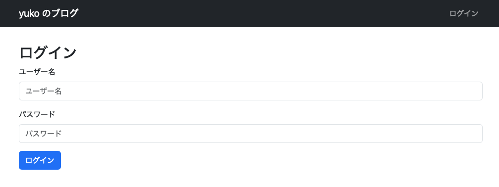
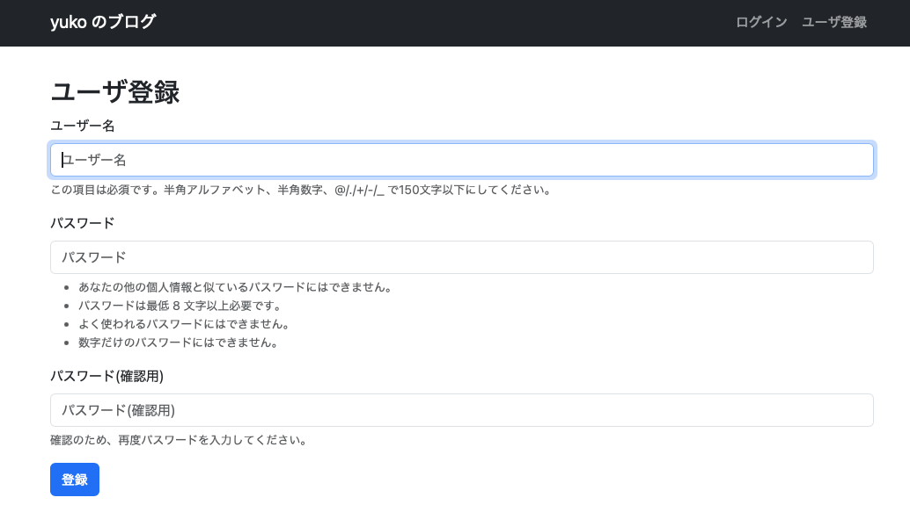

# Django でユーザ認証機能を実装する
前回、記事の新規作成や編集機能を実装しました。
本来であればログインした上で記事の作成や編集をすべきですが、ログイン機能を実装していなかったので、管理画面でログインしてから記事の作成に戻るという煩雑なことをしていました。
そこで、今回はユーザ認証機能を実装して、ログイン画面などを作っていきます。

## 認証用の Django アプリケーションを作成する
ユーザ認証はブログとは別機能になるので、```blog``` アプリケーションとは分けて実装するのが適切でしょう。
新しく ```accounts``` アプリケーションを作成します。

```bash
$ python manage.py startapp accounts
```

また、```settings.py``` に下記を追記します。

```backend/app/settings.py```
```python
INSTALLED_APPS = [
    ...
    'blog.apps.BlogConfig',
    'django_bootstrap5',
    'accounts.apps.AccountsConfig',
]
```

## 認証用のクラスベースビューを作成する
Django では、ログインやログアウトの画面に使えるビューが標準で提供されています。
今回は、それをそのまま使って実装を進めます。
```accounts/urls.py``` に下記を追記します。

```backend/accounts/urls.py```
```python
from django.contrib.auth.views import LoginView, LogoutView
from django.urls import path

urlptterns =[
    path(
        'login/',
        LoginView.as_view(
            redirect_authenticated_user=True,
            template_name='accounts/login.html',
        ),
        name='login'
    ),
    path('logout/', LogoutView.as_view(), name='logout'),
]
```

```LoginView``` や ```LogoutView``` はクラスベースビューと呼ばれる Python のクラスで、```as_view()``` メソッドを呼び出すことでビュー関数 (のようなもの) を返します。
```LoginView``` はデフォルトのテンプレートとして ```registration/login.html``` を参照しているので、```accounts/login.html``` に変更しています。
また、```redirect_authenticate_user=True``` とすることで、ログイン済みのユーザがログイン画面にアクセスした場合、トップページにリダイレクトされます。  
上記に加えて、```app/urls.py``` も変更します。

```backend/app/urls.py```
```python
urlpatterns = [
    ...
    path('accounts/', include("accounts.urls"))
]
```

次に、テンプレートを作成します。

```backend/accounts/templates/accounts/login.html```
```html




<h2>ログイン</h2>

<form method="post">
    
    <input type="hidden" name="next" value="{{ next }}" />
    
    
</form>

```

また、```base.html``` にログインやログアウトのボタンを追加しておきます。

```backend/templates/base.html```
```html


<html>
    <head>
        ...
    </head>
    <body>
        <nav class="navbar navbar-expand flex-md-row navbar-dark bg-dark">
            <div class="container justify-content-between">
                <a href="/" class="navbar-brand">yuko のブログ</a>
                <ul class="navbar-nav mr-md-2">
                    
                    <li class="nav-item">
                        <form action="" method="post" class="d-inline">
                            
                            <button type="submit" class="btn btn-link nav-link">ログアウト</button>
                        </form>
                    </li>
                    
                    <li class="nav-item"><a class="nav-link" href="">ログイン</a></li>
                    
                </ul>
            </div>
        </nav>
        <main>
            ...
        </main>
    </body>
</html>
```

ログインユーザに対してはログアウトページ、異認証ユーザに対してはログインページへのリンクをそれぞれ返しています。
ここで、`````` のように設定しておくと、```urls.py``` で設定した ```name``` 属性が一致するパスをレンダリング時に補完してくれます。
最後に、```settings.py``` を編集します。

```backend/app/settings.py```
```python
LOGIN_URL = '/accounts/login/'
LOGIN_REDIRECT_URL = '/'
LOGOUT_REDIRECT_URL = '/'
```

ログイン画面は以下のような見た目になります。
右上にログインやログアウトのボタンが表示されるので、操作を試してみてください。

<div align="center">
    
</div>

## ユーザ登録の実装
Django では、```UserCreationForm``` というフォームクラスを標準で提供しています。
このクラスを使いながらビューは自前で実装して、ユーザ登録機能を作成しましょう。
まずは、```accounts/urls.py``` にユーザ登録用のパスを追加します。

```backend/accounts/urls.py```
```python
from django.contrib.auth.forms import UserCreationForm
from django.contrib.auth.views import LoginView, LogoutView
from django.urls import path
from django.views.generic import CreateView

urlpatterns =[
    path(
        'signup/',
        CreateView.as_view(
            template_name='accounts/signup.html',
            form_class=UserCreationForm,
            success_url='/',
        ),
        name='signup'
    ),
    ...
]
```

```CreateView``` クラスを使って、テンプレートとフォーム、リクエスト成功時のリダイレクト先を指定してビューを作成します。
続いて、```signup.html``` を作成します。

```backend/accounts/templates/accounts/signup.html```
```html




<h2>ユーザ登録</h2>
<form method="post">
    
    
    
</form>

```

また、未承認ユーザがアクセスしたときに、ログインボタンと同時にユーザ登録のリンクも表示するようにします。

```backend/templates/base.html```
```html


<html>
    <head>
        ...
    </head>
    <body>
        <nav class="navbar navbar-expand flex-md-row navbar-dark bg-dark">
            <div class="container justify-content-between">
                <a href="/" class="navbar-brand">yuko のブログ</a>
                <ul class="navbar-nav mr-md-2">
                    
                    ...
                    
                    <li class="nav-item">
                        <a class="nav-link" href="">ログイン</a>
                    </li>
                    <li class="nav-item">
                        <a class="nav-link" href="">ユーザ登録</a>
                    </li>
                    
                </ul>
            </div>
        </nav>
        <main>
            ...
        </main>
    </body>
</html>
```

右上にユーザ登録ボタンが現れ、アクセスすると以下のような画面が表示されます。

<div align="center">
    
</div>