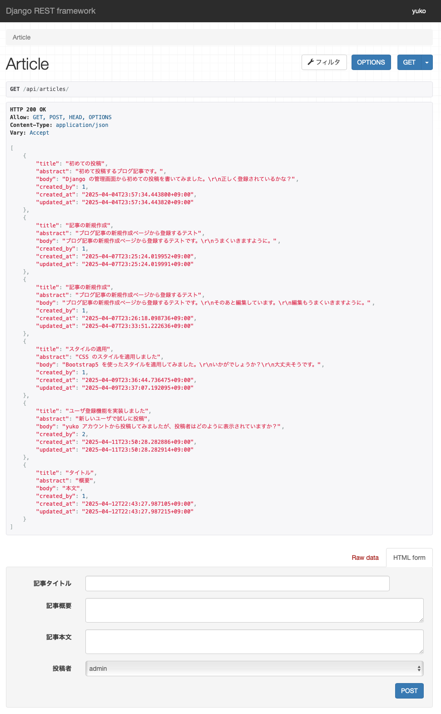

# JSON API の実装
元来、Django はフルスタックなフレームワークなので、バックエンドもフロントエンドも実装できます
ただ、このプロジェクトではフロントエンドを Next.js で実装予定なので、Django は Web API として機能してくれれば十分です。
今回は、Django REST Framework を用いて、これまで実装した内容をベースに JSON API を実装します。

## Django REST Framework のインストール
Docker の開発環境に Django REST Framework をインストールして、プロジェクト内で使えるようにします。
以下の通り書き換えて、コンテンナのビルドからやり直します。

```backend/Dockerfile```
```dockerfile
RUN pip install Django django-bootstrap5 djangorestframework
```

```backend/app/settings.py```
```python
INSTALLED_APPS = [
    ...
    'rest_framework',
]
```

## Serializer を用いた JSON との変換
JSON API では、データベースから取り出したモデルを JSON に変換 (シリアライズ、sirialize) したり、JSON で受け取ったデータをモデルに変換 (デシリアライズ、desirialize) したりする必要があります。
Django REST Framework では、この機能を ```Serializer``` クラスが担います。
```Serializer``` クラスはフォームクラスと同様、データのバリエーションも可能です。
Article モデルを JSON にシリアライズするコードは以下のようになります。

```backend/blog/serializers.py```
```python
from rest_framework import serializers
from .models import Article

class ArticleSerializer(serializers.ModelSerializer):
    class Meta:
        model = Article
        fields = ('title', 'abstract', 'body', 'created_by', 'created_at', 'updated_at')
```

シェルを起動して動作を確認してみましょう。

```bash
$ python manage.py shell
>>> from blog.models import Article
>>> from blog.serializers import ArticleSerializer
>>> a = Article.objects.get(id=1)
>>> serializer = ArticleSerializer(a)
>>> serializer.data
{'title': '初めての投稿', 'abstract': '初めて投稿するブログ記事です。', 'body': 'Django の管理画面から初めての投稿を書いてみました。\r\n正しく登録されているかな？', 'created_by': 1, 'created_at': '2025-04-04T23:57:34.443800+09:00', 'updated_at': '2025-04-04T23:57:34.443820+09:00'}
```

シリアライザ (ここでは ```ArticleSerializer```) のインスタンス化の際に ```many=True``` を指定すると、複数のレコードを一括でシリアライズできます。

```bash
>>> articles = Article.objects.all()[:3]
>>> serializer = ArticleSerializer(articles, many=True)
>>> serializer.data
[{'title': '初めての投稿', ...}, {'title': '記事の新規作成', ...}, {'title': '記事の新規作成', ...}]
```

逆に、デシリアライズも試してみましょう。

```bash
>>> from rest_framework.parsers import JSONParser
>>> from django.test import RequestFactory
>>> request = RequestFactory()
>>> req = request.post('api/articles', content_type='application/json', data={'title': 'タイトル', 'abstract': '概要', 'body': '本文', 'created_by': 1})
>>> data = JSONParser().parse(req)
>>> data
{'title': 'タイトル', 'abstract': '概要', 'body': '本文', 'created_by': 1}
>>> serializer = ArticleSerializer(data=data)
>>> serializer.is_valid()
True
>>> serializer.validated_data
{'title': 'タイトル', 'abstract': '概要', 'body': '本文', 'created_by': <User: admin>}
>>> serializer.save()
<Article: タイトル>
```

シリアライザの ```is_valid()``` メソッドでデータの評価を行い、データに問題がなければ ```validated_data``` にデータが入るので、```save()``` メソッドを呼び出すとデータベースに反映されます。

## ViewSets によるビューの記述
リクエストを受け取ってデータのシリアライズやデシリアライズを行い、レスポンスを返す処理を実装します。
Django REST Framework の ViewSets を使って記述するのが一般的ですが、以下のようにその機能を使わなくても実装できます。

```python
from rest_framework import status
from rest_framework.decorators import api_view
from rest_framework.response import Response
from blog.models import Article
from blog.serializers import ArticleSerializer

@api_view(['GET', 'POST'])
def article_list(request):
    if request.method == 'GET':
        articles = Article.objects.all()
        serializer = ArticleSerializer(articles, many=True)
        return Response(serializer.data)
    elif request.method == 'POST':
        serializer = ArticleSerializer(data=request.data)
        if serializer.is_valid():
            serializer.save()
            return Response(serializer.data, status=status.HTTP_201_CREATED)
    return Response(serializer.errors, status=status.HTTP_400_BAD_REQUEST)
```

さほど複雑なコードではありませんが、Django REST Framework で提供されているクラスベースビューを利用すると、さらに簡潔に記述できます。

```backend/blog/api_views.py```
```python
class ArticleViewSet(viewsets.ModelViewSet):
    queryset = Article.objects.all()
    serializer_class = ArticleSerializer
    filter_backends = (filters.OrderingFilter,)
    ordering_fields = ('id', 'created_at',)
    ordering = ('created_at',)
```

ここでは、```QuerySet``` や ```Serializer``` クラスと、一覧用エンドポイントのためのメタデータをいくつか指定しました。
次に、API のパスを追加します。

```backend/blog/api_urls.py```
```python
from django.urls import path
from blog import api_views

article_list = api_views.ArticleViewSet.as_view({
    'get': 'list',
    'post': 'create'
})
article_detail = api_views.ArticleViewSet.as_view({
    'get': 'retrieve',
    'put': 'update',
    'patch': 'partial_update',
    'delete': 'destroy'
})

urlpatterns = [
    path('', article_list, name='article-list'),
    path('<int:pk>/', article_detail, name='article-detail'),
]
```

```backend/app/urls.py```
```python
urlpatterns = [
    ...
    path('api/articles/', include('blog.api_urls'))
]
```

ブラウザで [http://localhost:8000/api/articles/](http://localhost:8000/api/articles/) にアクセスしてみると、以下のように API レスポンスの内容が整形されて表示されます。

<div align="center">
    
</div>

## Router を用いた URL ディスパッチ
Router クラスを使うことで、URL の記述をより簡略化することができます。
先ほどは、```api_urls.py``` を作成して、その中にパスの定義を追加しましたが、Router クラスを利用すれば ```app/urls.py``` の中でコードが完結します。

```backend/app/urls.py```
```python
from django.urls import path, include
from rest_framework import routers

from blog import api_views as blog_api_views

router = routers.DefaultRouter()
router.register('articles', blog_api_views.ArticleViewSet)

urlpatterns = [
    ...
    path("api/", include(router.urls))
]
```

正直、実装の中身がよく見えなくなってしまうので、個人的にあまり好きではありませんが、```DefaultRouter``` クラスを利用することで、

- HATEOAS (Hypertext As The Engine Of Application State) を利用できるようになる
- 様々なメディアタイプの指定方法に対応する
- 様々な API バージョニング指定方法に対応する

などのメリットがあります。
HATEOAS は API ルートにアクセスすると、以下のような画面が表示され API の URL をブラウザで辿れるようになります。

[http://localhost:8000/api/](http://localhost:8000/api/)

<div align="center">
    
</div>