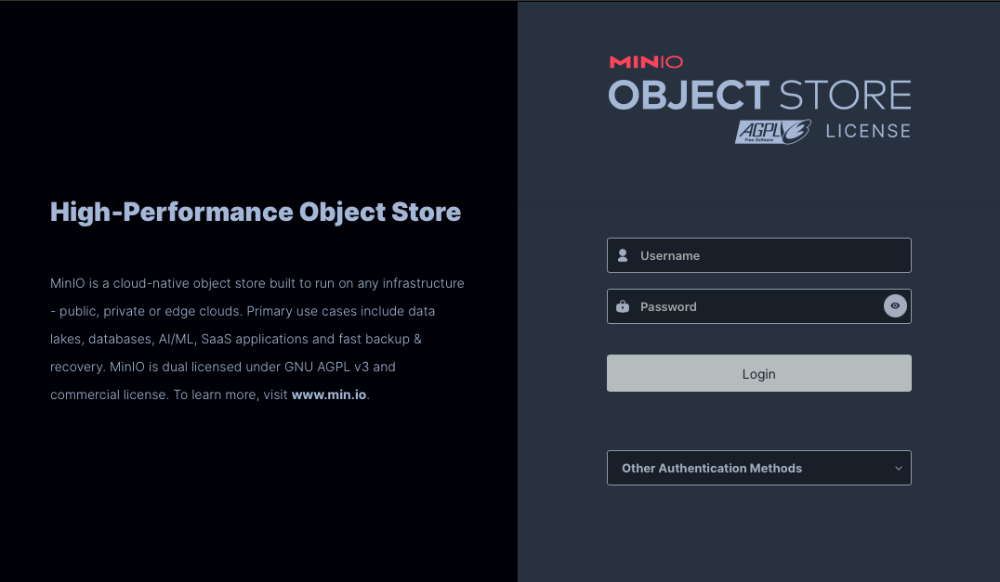
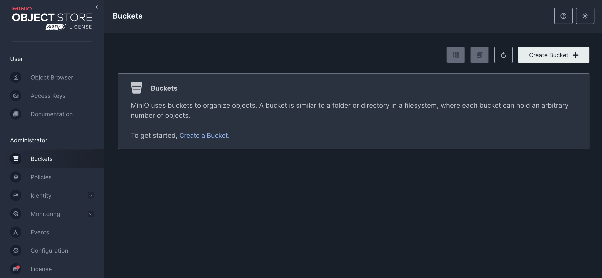
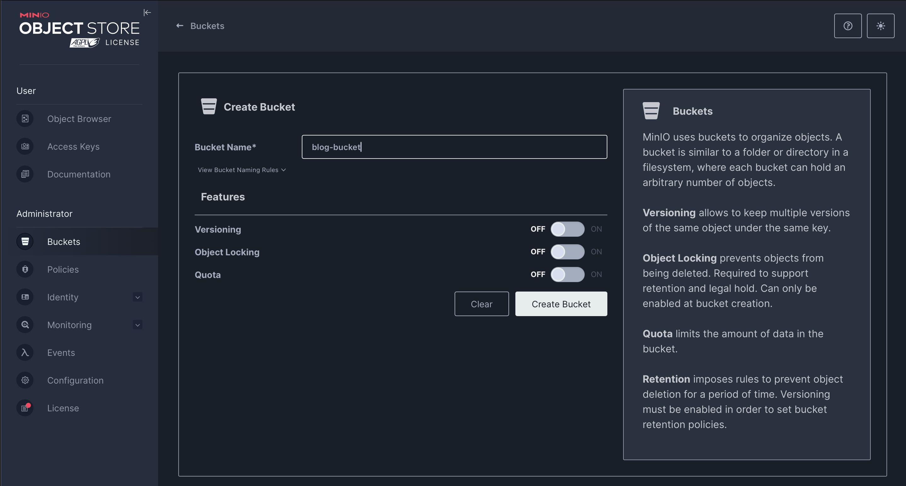
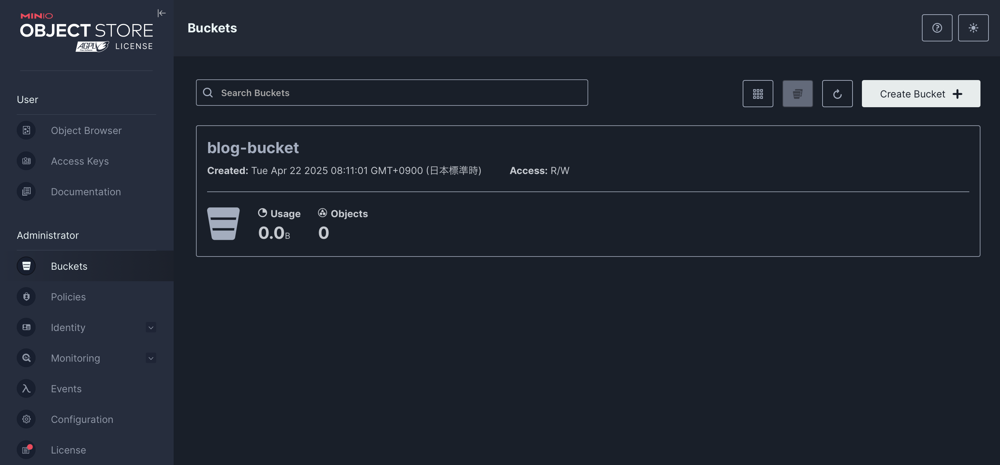

# MinIO の導入
今回から、何回かに分けてファイルアップロード機能を実装します。
アップロードされたファイルは S3 互換ストレージである MinIO に保存したいので、今回は開発環境に MinIO を導入します。

## Docker 環境の立ち上げ
まずは、Docker Compose で MinIO の 環境を作成します。
[DockerHub](https://hub.docker.com/r/minio/minio) に MinIO のイメージが置かれているので、これを利用します。
```docker-compose.yml``` に以下を追記します。

```docker-compose.yml```
```yml
services:
  blog_storage:
    image: minio/minio:RELEASE.2025-04-08T15-41-24Z
    container_name: minio_container
    ports:
      - 9000:9000
      - 9001:9001
    tty: true
    environment:
      - MINIO_ROOT_USER: minioadmin
      - MINIO_ROOT_PASSWORD: miniopassword
    volumes:
      - minio-volume:/data
    command: server /data --console-address :9001

volumes:
  minio-volume:
```

Docker Volume をコンテナの ```/data``` にマウントしてデータ保存先に指定し、9001番ポートで Web UI を起動します。
```docker compose pull``` でイメージを取得して、```docker compose up blog_storage``` でコンテナを起動します。
[http://localhost:9001/](http://localhost:9001/) にアクセスすると、ログインページが表示されます。
上記の ```MINIO_ROOT_USER``` と ```MINIO_ROOT_PASSWORD``` で設定したユーザとパスワードでログインできます。

<div align="center">
    
</div>

## Web UI からバケットを作成する
ネット上では、MinIO とは別のコンテナを一時的に立ち上げ、MinIO で提供されている ```mc``` コマンドを使ってバケットの作成を自動化する方法も紹介されています
([Qiita: docker-composeでMinIO立ててLaravelでS3ごっこしゅる](https://qiita.com/layzy_glp/items/bbf4ee5237bae50db9f2))。
この方法は、チーム開発などでは有効だと思いますが、このプロジェクトは個人開発なので Web UI から作ることにします。  
まず、左ペインの ```Buckets``` を選択して、右上の ```Create Bucket``` ボタンをクリックします。

<div align="center">
    
</div>

```Bucket Name``` の欄に好きな名前を入力して ```Create Bucket``` ボタンを押下すれば、バケットが作成されます。

<div align="center">
    
</div>

バケットの作成は完了です。

<div align="center">
    
</div>