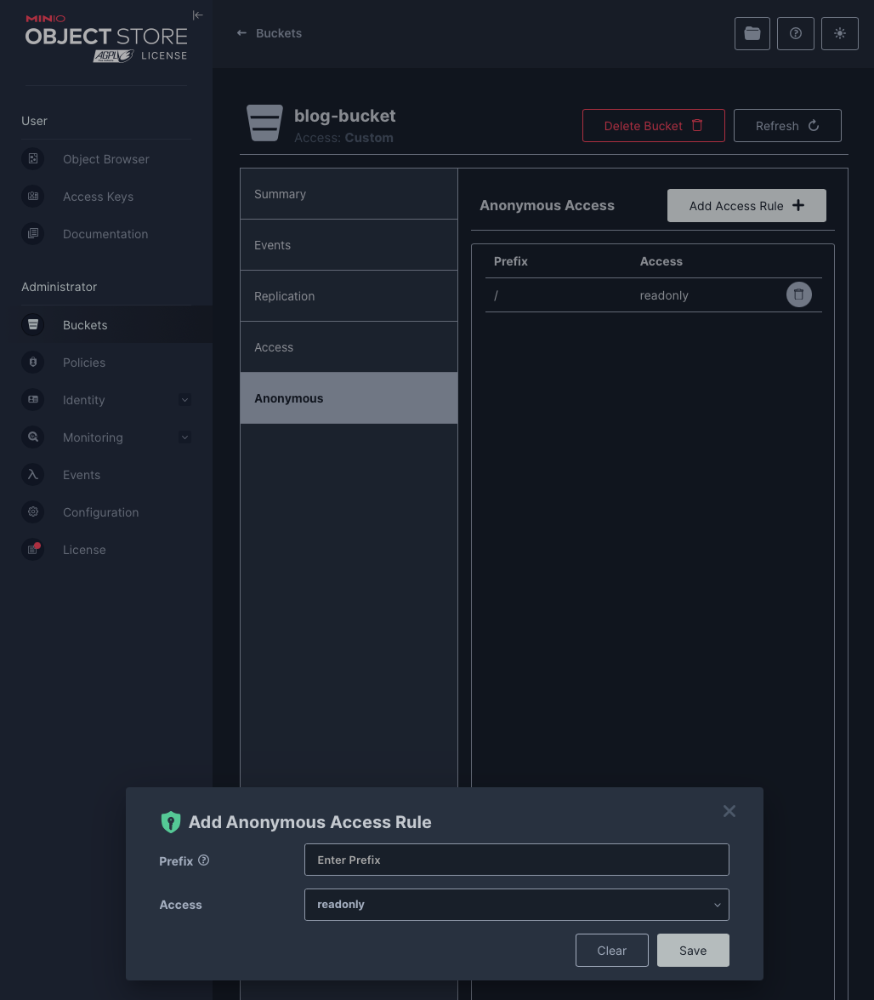

# Django と MinIO　の接続
前回は、Docker で MinIO の環境を立ち上げました。
今回は、Django 経由で MinIO にファイルをアップロードする方法を見ていきます。

## 必要なパッケージの導入
まずは、Django に必要なパッケージを導入します。
MinIO は S3 互換のオブジェクトストレージですので、Python 向けの AWS SDK である [boto3](https://aws.amazon.com/jp/sdk-for-python/) を利用します。

```backend/Dockerfile```
```dockerfile
RUN pip install boto3 pillow
```

## ```docker-compose.yml``` の編集
```docker-compose.yml``` を少し編集します。
コンテナ間の通信は ```http://[service名]:[ポート番号]``` で行います。
この時、```[service名]``` の部分にアンダースコア (```_```) が入っていると、不具合を生じる可能性があります。
いろいろ試したところ、```curl``` コマンドではアンダースコアが入っていてもコンテナ間の疎通確認が取れた一方、```boto3``` ではホスト名にアンダースコアが含まれる場合には、```Invalid endpoint``` というエラーになってしまいます。
そのため、その場しのぎの対応になりますが、```blog_strorage``` を ```blog-storage``` のように、アンダースコアをハイフンに変更しました。

## MinIO の設定変更
MinIO に画像をアップロードしても、非認証ユーザが画像を参照できなければ画像を表示できないので、バケットを読み込み専用で公開できるようにします。
MinIO の管理画面にログインし、「Buckets」→「blog-bucket」(操作対象のバケット)を開きます。
「Anonymous」タブの「Add Access Rule」ボタンを押下すると、匿名ユーザのアクセスルールの設定ウィンドウが開きます。

<div align="center">
    
</div>

バケット内の画像は全て読み取りのみ許可したいので、「Prefix」欄には ```/``` を、「Access」欄には ```readonly``` を指定しておきます。

## ```media``` アプリケーションの作成
```blog``` アプリケーション内で画像アップロード機能を完結させることもできますが、MinIO にファイルをアップロードする機能は、```media``` アプリケーションとして切り出して実装します。
下記のコマンドで新しいアプリケーションを作成します。

```bash
$ python manage.py startapp media
```

また、```settings.py``` に下記を追記します。

```backend/app/settings.py```
```python
INSTALLED_APPS = [
    ...
    'media.apps.MediaConfig',
    ...
]
```

## MinIO クライアントの取得関数
MinIO とのコネクションを確立して MinIO クライアントを取得する関数を定義しておきます。
まずは、```.env```　ファイルに MinIO の認証情報などをセットしておきます。

```backend/.env```
```env
MINIO_ENDPOINT=blog-storage:9000
MINIO_ACCESS_KEY=minioadmin
MINIO_SECRET_KEY=miniopassword
MINIO_BUCKET_NAME=blog-bucket
MINIO_USE_SSL=False
```

```MINIO_ACCESS_KEY``` には ```docker-compose.yml``` の MinIO の設定で ```MINIO_ROOT_USER``` にセットした値を、```MINIO_ACCESS_KEY``` には同じく ```MINIO_ROOT_PASSWORD``` にセットした値を設定しておきます。
次に、この ```.env``` ファイルを環境変数として読み込むように ```docker-compose.yml``` を変更します。

```docker-compose.py```
```yaml
services:
  ...

  blog_backend:
    ...
    env_file:
      - ./backend/.env
```

この環境変数を読み込んで、MinIO の URL などを取得する関数と MinIO クライアントを取得する関数を定義します。

```backend/blog/utils.py```
```python
import os
import boto3

def get_minio_bucket_name():
    return os.getenv('MINIO_BUCKET_NAME')

def get_minio_bucket_url():
    endpoint = os.getenv('MINIO_ENDPOINT')
    bucket = os.getenv('MINIO_BUCKET_NAME')
    use_ssl = os.getenv('MINIO_USE_SSL', 'False').lower() == 'true'
    return f"http{'s' if use_ssl else ''}://{endpoint}/{bucket}/"

def get_minio_client():
    endpoint = os.getenv('MINIO_ENDPOINT')
    access_key = os.getenv('MINIO_ACCESS_KEY')
    secret_key = os.getenv('MINIO_SECRET_KEY')
    use_ssl = os.getenv('MINIO_USE_SSL', 'False').lower() == 'true'

    return boto3.client(
        's3',
        endpoint_url=f"http{'s' if use_ssl else ''}://{endpoint}",
        aws_access_key_id=access_key,
        aws_secret_access_key=secret_key,
    )
```

コンソールから動作確認してみます。
```get_minio_client()``` を呼び出してみて、S3 クライアントのオブジェクトが返ってきていることを確認します。

```bash
$ python
>>> from blog.utils import get_minio_client
>>> get_minio_client()
<botocore.client.S3 object at 0xffffad377380>
```

## モデルの定義とマイグレーション
次に、画像を保持するモデルを作成します。
画像の情報を保持する ```Image``` モデルには以下のフィールドを定義します。

- ```title```: 画像のタイトル、画像のキャプションや ```alt``` プロパティとして利用
- ```thumbnail_url```: サムネイル用の小さい画像 (長辺 300px) の URL
- ```display_url```: 記事の中で表示する中くらいのサイズの画像 (長辺 1000px) の URL
- ```original_url```: オリジナルサイズの画像の URL
- ```uploaded_at```: 画像がアップロードされた日時

```backend/media/models.py```
```python
class Image(models.Model):
    title = models.CharField('画像タイトル', max_length=128)
    thumbnail_url = models.CharField('サムネイル画像の URL', max_length=256)
    display_url = models.CharField('表示用画像の URL', max_length=256)
    original_url = models.CharField('オリジナル画像の URL', max_length=256)
    uploaded_at = models.DateTimeField('アップロード日時', auto_now_add=True)

    def __str__(self):
        return self.title
```

続いて、マイグレーションを実行してデータベースにテーブルを作成します。

```bash
$ python manage.py makemigrations
Migrations for 'blog':
  blog/migrations/0003_image.py
    + Create model Image

$ python manage.py migrate       
Operations to perform:
  Apply all migrations: admin, auth, blog, contenttypes, sessions, token_blacklist
Running migrations:
  Applying blog.0003_image... OK
```

## Serializer の定義
続いて、Serializer を定義します。
```serializers.py``` に下記を追記します。

```backend/media/serializers.py```
```python
from rest_framework import serializers
from .models import Image

class ImageSerializer(serializers.ModelSerializer):
    class Meta:
        model = Image
        fields = ('title', 'thumbnail_url', 'display_url', 'original_url', 'uploaded_at')
```

## View の作成
API 経由でアップロードされた画像を、リサイズ加工して MinIO に保存する View を作成します。
処理の流れは以下の通りです。

1. リクエストボディから画像のタイトルとファイルを取り出す → どちらかに不備があればエラーを返す
2. 画像を読み込んで JPEG 形式でバッファに書き込む
3. 読み込んだ画像を表示用とサムネイル用にリサイズしてバッファに書き込む → 2 or 3 でエラーが出た場合にはそのエラーを返す
4. MinIO クライアントを取得し、MinIO に画像を保存する → アップロードにしっぱしたらそのエラーを返す
5. アクセス用の URL を構築してデータベースに保存する
6. 保存した画像のレコードを JSON にシリアライズしてレスポンスとして返す

4 で保存するときの名前は、ファイル名の衝突を避けるため、Python の ```uuid``` ライブラリで生成したファイル名を指定します。
また、5 で保存するアクセス用 URL は、仮の値を入れておきます。
(次回以降で実際に使える URL を保存するように変更します。)


```backend/media/views.py```
```python
import uuid
from PIL import Image
from io import BytesIO

from rest_framework import status
from rest_framework.views import APIView
from rest_framework.response import Response

from .models import Image as ImageModel
from .serializers import ImageSerializer
from .utils import get_minio_client, get_minio_bucket_url, get_minio_bucket_name, keep_aspect_image_resize


class ImageUploadView(APIView):
    def post(self, request):
        # リクエストから画像のタイトルとファイルを取り出す
        title = request.data.get('title')
        img_file = request.FILES.get('image')
        if (not title) or (not img_file):
            return Response(
                {'error': 'title and image file are required'},
                status=status.HTTP_400_BAD_REQUEST
            )
        
        # 画像を読み込んでリサイズし、バッファに書き出す
        try:
            # オリジナルの画像
            original_img = Image.open(img_file)
            original_img_buffer = BytesIO()
            original_img.save(original_img_buffer, format='JPEG')
            original_img_buffer.seek(0)

            # 長辺 1000 ピクセルの表示用画像を作成
            display_img = keep_aspect_image_resize(img_file, 1000)
            display_img_buffer = BytesIO()
            display_img.save(display_img_buffer, format='JPEG')
            display_img_buffer.seek(0)

            # 長辺 300 ピクセルのサムネイル画像を作成
            thumbnail_img = keep_aspect_image_resize(img_file, 300)
            thumbnail_img_buffer = BytesIO()
            thumbnail_img.save(thumbnail_img_buffer, format='JPEG')
            thumbnail_img_buffer.seek(0)
        except Exception as e:
            return Response(
                {'error': 'image processing failed: ' + str(e)},
                status=status.HTTP_500_INTERNAL_SERVER_ERROR
            )
        
        # UUID で名前を決定
        original_img_filename = str(uuid.uuid4()) + ".jpg"
        display_img_filename = str(uuid.uuid4()) + ".jpg"
        thumbnail_img_filename = str(uuid.uuid4()) + ".jpg"

        # MinIO のクライアントを取得してそれぞれの画像を保存
        s3 = get_minio_client()
        bucket = get_minio_bucket_name()
        print(bucket, original_img_filename)
        try:
            s3.upload_fileobj(original_img_buffer, bucket, original_img_filename, ExtraArgs={'ContentType': 'image/jpeg'})
            s3.upload_fileobj(display_img_buffer, bucket, display_img_filename, ExtraArgs={'ContentType': 'image/jpeg'})
            s3.upload_fileobj(thumbnail_img_buffer, bucket, thumbnail_img_filename, ExtraArgs={'ContentType': 'image/jpeg'})
        except Exception as e:
            return Response(
                {'error': 'MinIO upload failed: ' + str(e)},
                status=status.HTTP_500_INTERNAL_SERVER_ERROR
            )
        
        # アクセス URL の構築
        original_url = get_minio_bucket_url() + original_img_filename
        display_url = get_minio_bucket_url() + display_img_filename
        thumbnail_url = get_minio_bucket_url() + thumbnail_img_filename

        # モデルに保存
        uploaded_image = ImageModel.objects.create(
            title=title,
            thumbnail_url=thumbnail_url,
            display_url=display_url,
            original_url=original_url
        )
        serializer = ImageSerializer(uploaded_image)
        return Response(serializer.data, status=status.HTTP_201_CREATED)
```

## パスの追加
最後に、```urls.py``` にパスを追記して完了です。
```/image``` パスに POST すると画像がアップロードされるようにします。

```backend/app/urls.py```
```python
from media.views import ImageUploadView

urlpatterns = [
    ...
    path('api/image/', ImageUploadView.as_view(), name='image_upload'),
    ...
]
```

## 動作確認
まだフロントエンドはできていないので、 ```curl``` コマンドで画像をアップロードしてみます。

```bash
$ curl -X POST http://localhost:8000/api/image/ -F "title=Test Image" -F "image=@<画像のパス>"
{"title":"Test Image","thumbnail_url":"http://blog-storage:9000/blog-bucket/374f7c3e-c6b0-4410-be3f-3d413195a8b1.jpg","display_url":"http://blog-storage:9000/blog-bucket/03542223-c003-4d42-a9ad-e0eb6e9368b6.jpg","original_url":"http://blog-storage:9000/blog-bucket/1299c689-3165-40ea-8f8d-1c21d716328e.jpg","uploaded_at":"2025-04-28T22:02:10.371331+09:00"}%
```

MinIO や Django の管理画面からアップロードされていることを確認できます。

<div align="center">
    
</div>

<div align="center">
    
</div>