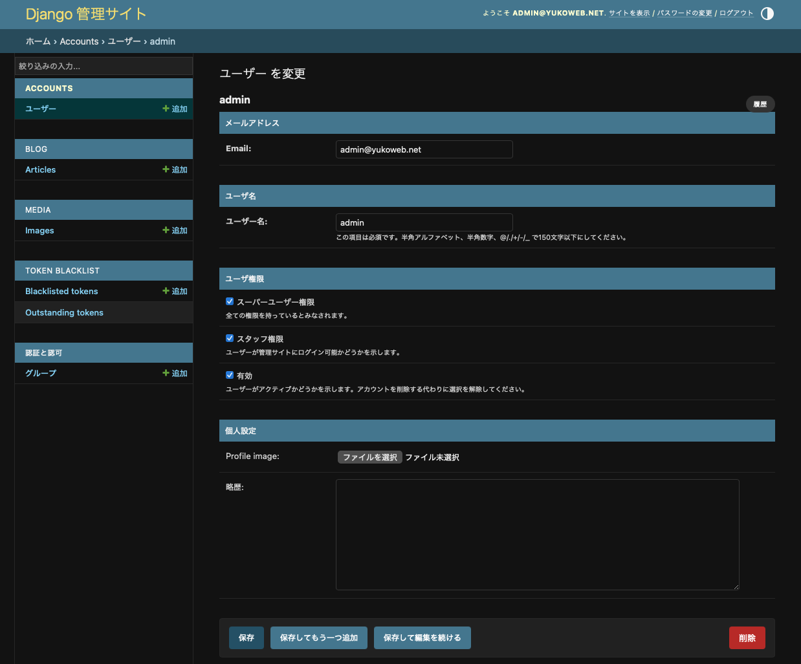
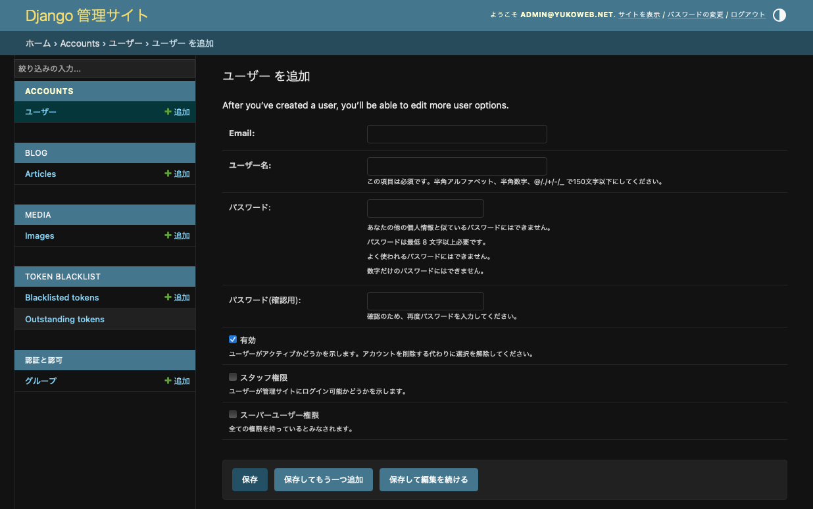

# Django の認証機能の改修
以前、Django で JWT 認証機能を実装しました。
その際には、Django がデフォルトで提供している ```user``` モデルを使って実装していました。
この方法は簡単な反面、後からカスタマイズすることが難しくなってしまいます。
そこで、今回はカスタムユーザモデルを定義します。
また、ユーザの権限ごとにアクセス可能なページを分けるため、JWT 発行時にユーザ権限を含めて発行するように改修を行います。

## カスタムユーザモデルの定義
これまでは、Django のデフォルトユーザモデルを利用してきました。
ただ、フィールドの追加などが難しいため、今後の使いやすさも考えてカスタムユーザモデル ```CustomUser``` を定義します。
```AbstractUser``` クラスを継承して実装するため、改めて ```username``` や ```password``` のフィールドを定義する必要はありません。
カスタムユーザモデルには、追加で以下のフィールドを定義します。
特にユーザ

| フィールド名 | 説明 | 形式 |
| :--: | :--: | :--: |
| ```profile_image``` | プロフィール画像 | ImageField |
| ```bio``` | ユーザの略歴・自己紹介 | TextField |
| ```email``` | メールアドレス |  EmailField |
| ```created_at``` | 作成日時 | DateTimeField |
| ```updated_at``` | 更新日時 | DateTimeField |

```backend/accounts/models.py```
```python
from django.db import models
from django.contrib.auth.models import AbstractUser

# Create your models here.

class CustomUser(AbstractUser):
    email = models.EmailField(unique=True)
    created_at = models.DateTimeField("投稿日", auto_now_add=True)
    updated_at = models.DateTimeField("更新日", auto_now=True)
    profile_image = models.ImageField(upload_to='profiles/', blank=True, null=True)
    bio = models.TextField('略歴', blank=True)

    # 不要なフィールドは無効にしておく
    first_name = None
    last_name = None
    date_joined = None
    groups = None
    user_permissions = None

    # ログインにはメールアドレスを利用する
    USERNAME_FIELD = 'email'
    # ユーザ名とメールアドレスの設定は必須
    REQUIRED_FIELDS = ['username']

    def __str__(self):
        return self.username
```

## ```settings.py``` の編集とマイグレーション
認証に使うユーザモデルを指定する設定を追加します。

```backend/app/setting.py```
```python
# 認証に使うモデルの指定
AUTH_USER_MODEL = 'accounts.CustomUser'
```

Django では、```admin``` や ```auth``` などのデフォルトアプリが、デフォルトの ```User``` モデルありきで作られているため、後から ```CustomUser``` に変更しようとするとエラーとなってしまいます。
そこで、まだ開発初期なので、一旦これまでのデータを削除します。

```bash
$ rm db.sqlite3
$ find . -path "*/migrations/*.py" -not -name "__init__.py" -delete
$ find . -path "*/migrations/*.pyc"  -delete
```

その後、マイグレーションをやり直します。

```bash
$ python manage.py makemigrations accounts
$ python manage.py makemigrations         
$ python manage.py migrate
```

最後に、管理ユーザを作成しておきます。

```bash
$ python manage.py createsuperuser
Email: admin@yukoweb.net
ユーザー名: admin
Password: 
Password (again):
```

## 管理画面の編集
下記のように ```admin.py``` に記述を追加すれば、Django 管理サイトから ```CustomUser``` のレコードを確認したり、作成したりできます。

```backend/accounts/admin.py```
```python
from django.contrib import admin
from django.contrib.auth import get_user_model

CustomUser = get_user_model()
admin.site.register(CustomUser)
```

ただ、暗号化されたパスワードや最終ログインの記録など、編集できる必要のない項目まで編集できてしまいます。
そのため、管理画面に表示する内容を編集します。

```backend/accounts/admin.py```
```python
from django.contrib import admin
from django.contrib.auth.admin import UserAdmin
from django.utils.translation import gettext_lazy as _
from .models import CustomUser

class CustomUserAdmin(UserAdmin):
    # 一覧画面にの表示する項目
    list_display = ('email', 'username', 'is_superuser', 'is_staff', 'is_active')
    
    # 一覧画面で絞り込める項目
    list_filter = ('is_superuser', 'is_staff', 'is_active')

    # 既存レコードで表示するフィールド
    fieldsets = [
        ('メールアドレス', {'fields': ('email', )}),
        ('ユーザ名', {'fields': ('username', )}),
        ('ユーザ権限', {'fields': ('is_superuser', 'is_staff', 'is_active')}),
        ('個人設定', {'fields': ('profile_image', 'bio')}),
    ]

    # 新規作成画面で表示するフィールド
    add_fieldsets = [
        (None, {
            'classes': ('wide',),
            'fields': ('email', 'username', 'password1', 'password2', 'is_active', 'is_staff', 'is_superuser'),
        }),
    ]

admin.site.register(CustomUser, CustomUserAdmin)
```

これで、ユーザの情報を表示するページは以下のようになります。

<div align="center">
    
</div>

また、新規作成ページは以下の通り表示されます。

<div align="center">
    
</div>
